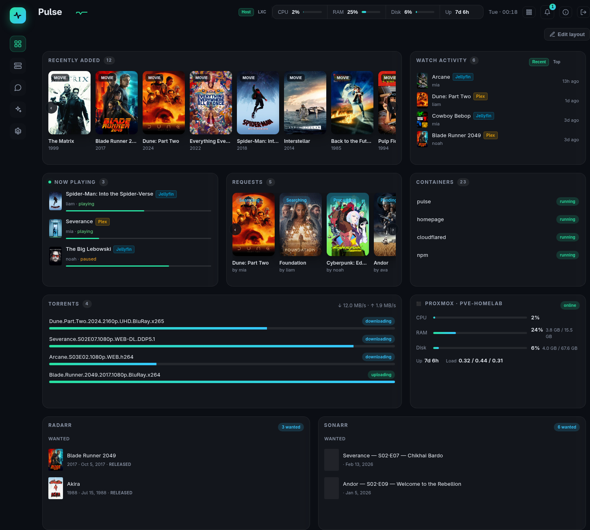
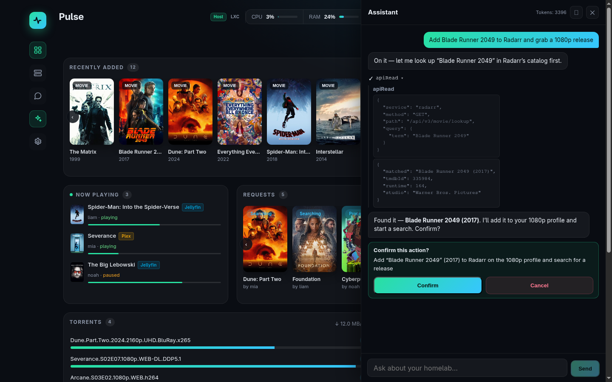
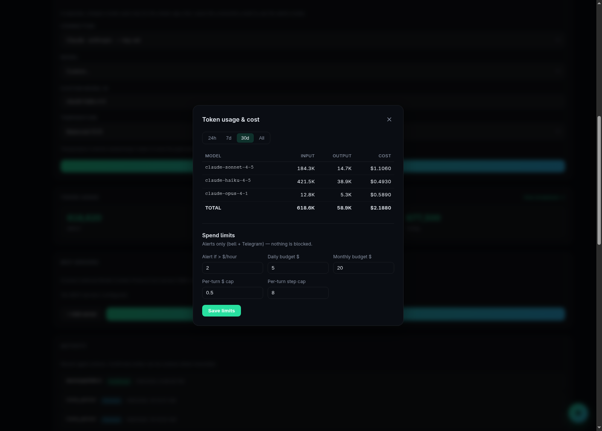
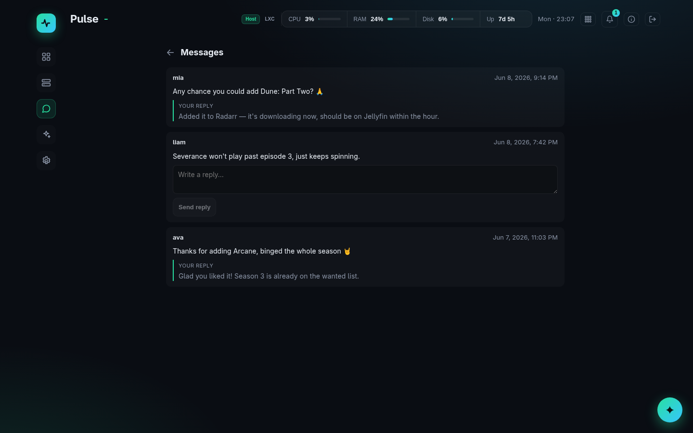
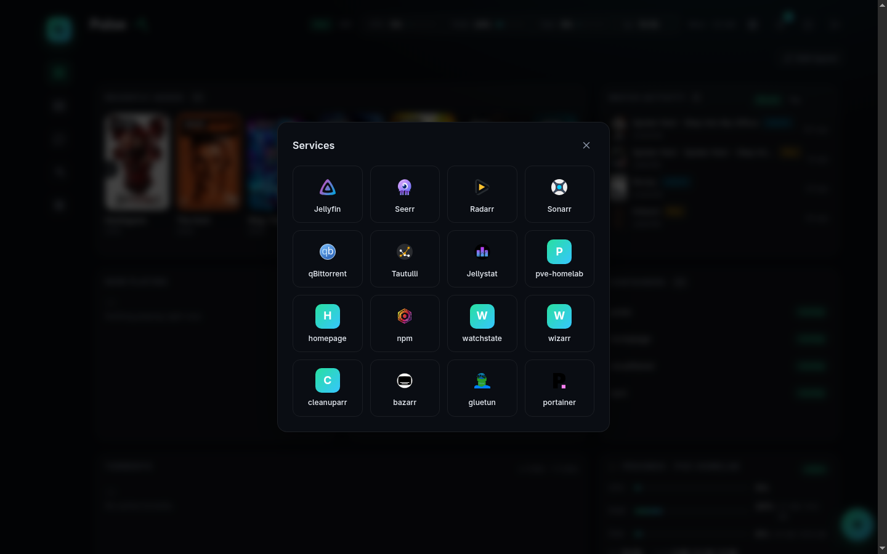
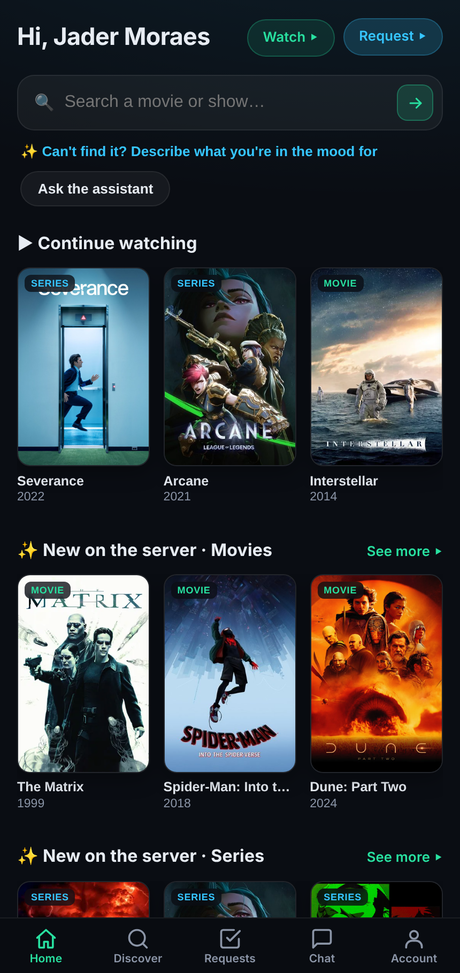
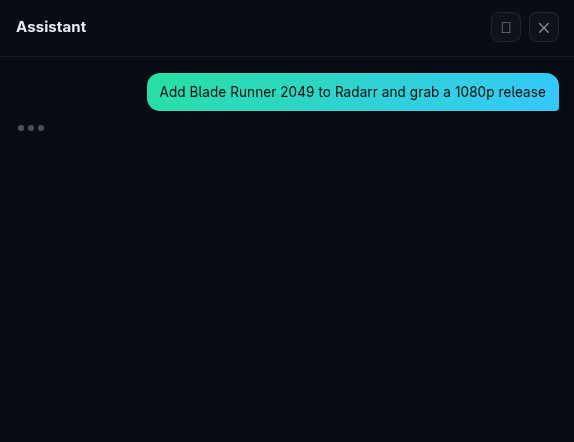

<div align="center">

<picture>
  <source media="(prefers-color-scheme: dark)" srcset="docs/screenshots/pulse-header.png" />
  
</picture>

### Your homelab, in one cockpit — with an AI that can actually run it.

A self-hosted **SvelteKit dashboard** that unifies your media servers, download clients, request manager, Docker host, and metrics — and ships with an **embedded AI assistant** that reads *and acts on* the entire stack in plain language, an **invite-only consumer PWA**, **per-model AI cost guardrails**, a notification hub, and a Telegram channel.

[](https://kit.svelte.dev/)
[](https://www.typescriptlang.org/)
[](https://github.com/WiseLibs/better-sqlite3)
[](#-the-ai-control-plane)
[](#-consumer-pwa)
[](#-testing)
[](#)

<br/>

<!-- 👉 drop a hero shot here: docs/screenshots/dashboard.png -->


</div>

---

## ✨ Highlights

| | |
|---|---|
| 🧩 **Unified cockpit** | Drag-and-resize widget grid + drill-downs for Jellyfin · Plex · Radarr · Sonarr · Jellyseerr · qBittorrent · Tautulli · Jellystat · Proxmox · Docker · host metrics. |
| 🧠 **AI control plane** | Chat with your homelab. The admin agent reads live state **and performs writes** across every service's API — *"add The Bear to Sonarr and grab a 1080p release," "restart Jellyfin," "start VM 100"* — **confirming every write**, with a full audit log + undo. |
| 👥 **Consumer PWA** | Invite-only, Jellyfin-federated app at `/app`: discover, request, save a watchlist, get push-notified when it lands, and chat with a scoped (cheaper-model) assistant — all metered against a monthly token plan. |
| 🔔 **Notifications & messages** | Event-feed bell (downloads/stalls/requests/containers/disk), an admin↔viewer **message inbox**, and an optional **Telegram** channel for both. |
| 💸 **Cost guardrails** | Per-model **$ usage breakdown** + warn-only spend guardrails (rapid-burn / daily / monthly / per-turn) that ping the bell + Telegram before a runaway bill. |
| 🔐 **Secure by design** | Secrets encrypted at rest, **never sent to the LLM**; dual-session admin/consumer isolation; an env-pinned host guard for safe public exposure. |

## 📸 Screenshots

> _Images live in [`docs/screenshots/`](docs/screenshots/). Drop in PNGs/GIFs with these names and they'll render here._

<p align="center"><b>AI assistant</b> — reads <i>and acts on</i> the stack, confirming every write</p>
<p align="center"></p>

<p align="center"><b>Per-model cost &amp; spend guardrails</b></p>
<p align="center"></p>

<p align="center"><b>Admin ↔ viewer message inbox</b></p>
<p align="center"></p>

<p align="center"><b>Services launcher</b> — quick-launch with live logos</p>
<p align="center"></p>

<p align="center"><b>Consumer PWA</b> — discover · request · watchlist · ask the assistant</p>
<p align="center"></p>

<p align="center"><b>The agent, end-to-end</b> — <i>"add Blade Runner 2049 to Radarr and grab a 1080p release"</i> → tool call → confirm card → done</p>
<p align="center"></p>

---

## 🚀 Quick start

```sh
npm install
npm run dev            # dev server with HMR
# production:
npm run build
node build             # serves the adapter-node build
```

First run redirects to `/setup` to create the admin account. Then add your services in **Settings → Connections**. Or run it the way it's meant to run — one container:

```yaml
# compose.yaml (excerpt)
services:
  pulse:
    build: .
    ports: ["3002:3000"]
    volumes:
      - pulse_data:/data
      - /var/run/docker.sock:/var/run/docker.sock   # container widgets + agent control
      - /proc:/host/proc:ro
      - /sys:/host/sys:ro                            # host metrics
    environment:
      - PULSE_PROC_ROOT=/host/proc
      - PULSE_SYS_ROOT=/host/sys
```

---

## 🧠 The AI control plane

The admin assistant lives inside the dashboard (a rail entry + a floating ✦ panel). It reads live state through the same integration layer the widgets use — and, uniquely, can **act on any configured service's REST API** through a generic, secure passthrough.

**Full read/write, in natural language.** Beyond a handful of curated actions, the agent has `apiRead` / `apiWrite` (any service's API — Radarr, Sonarr, Seerr, qBittorrent, Jellyfin, Plex, Tautulli, Proxmox…) and `dockerApi` / `dockerWrite` (the Docker Engine). So it can *add a series, list & grab a specific release, add a torrent, change a quality profile, start/stop a VM or container* — without a hand-coded tool for each. **The model never sees a secret:** it supplies only method/path/body; Pulse injects the per-service auth server-side and scrubs results.

**Confirm every write — non-negotiable.**
- **Reads run freely** and stream back inline.
- **Every write pauses for you** with a plain-English **Confirm / Cancel** card (or signed Telegram buttons). There is *no other write path*.
- **Everything executed is audited** in the **Activity** log (who/when/tool/args/result), with **Undo** where an inverse exists.
- Pending confirmations are server-held with a TTL — navigate away and they expire **without** executing.

**Provider-agnostic & cost-aware.** Bring your own key for **Anthropic / OpenAI / Gemini**, or point at any **OpenAI-compatible** endpoint (**Ollama**, **LM Studio**, **OpenRouter**). The system prompt is prompt-cached; usage is metered **per model with a $ estimate**; spend guardrails alert before a runaway bill. Configure under **Settings → AI**.

**MCP — the elevate layer.** Plug in external **Model Context Protocol** servers (web search, a read-only filesystem on `/mnt/tank`, Home Assistant, TMDB/Trakt…). Their tools are merged into the agent's registry and pass through the **same policy + confirm + audit gate**; unreachable servers degrade gracefully.

> _Want it on your phone?_ Link a Telegram bot and the **same agent** is reachable in chat — with writes surfaced as **HMAC-signed inline Approve/Deny buttons**.

---

## 👥 Accounts, roles & the consumer PWA

Pulse serves **two fully isolated audiences** (separate session cookies + route guards): the **admin cockpit**, and a lightweight **consumer app** at `/app` that never sees the cockpit.

**Jellyfin-federated login.** Consumers sign in with their **Jellyfin** credentials; Pulse stores **no consumer password** — every login re-validates against Jellyfin.

**Custom roles.** Build roles in **Settings → Users & Roles**: a capability allow-list (`discover` · `request` · `status` · `watchlist` · `message_admin`), a **monthly token plan**, auto-approve, and a seerr quota. Per-user overrides layer on top. The **Admin** role is immutable.

**Invite → onboard → auto-provision.** Mint a single-use, role-bound invite link. The invitee picks a Jellyfin username/password, and Pulse provisions their downstream accounts **idempotently with rollback** — a Jellyfin user, then a seerr user with the role's quota — only marking the invite used **after** success (so a failed onboard is retry-safe). Optional **Plex** OAuth + library-share layer on additively.

### 📱 Consumer PWA

One installable, mobile-first app where an invited viewer can:

- **Discover** — a hybrid home blending an ask-bar, their live request strip, and rows for *Continue watching*, *New on the server* (▶ deep-link), and *Hot right now* (seerr trending, **+ Request**).
- **Request & track** — requests are attributed to the viewer's own seerr identity; Pulse flips them to **available** and notifies exactly once.
- **Watchlist** — save titles (on-server or not); on-server saves mirror into the viewer's **Jellyfin Favorites**, and "**notify me when it arrives**" fires when it lands.
- **Chat** — a scoped assistant: filtered toolset (only their role's reads/requests — never admin tools), a **separate, cheaper model**, prompt caching, and **per-turn token metering** against the monthly cap.
- **Message the admin** — reach you from chat; it lands in your inbox + Telegram, and your reply comes back as a push.
- **Install + push** — web app manifest + service worker → add-to-home-screen + web-push (VAPID, private key encrypted; iOS requires add-to-home-screen first).

Token plans are named tiers (**Light 250k · Regular 1M · Power 5M · Unlimited · Custom**); My Account shows a "~N chats left, resets in N days" bar. Caps block AI turns at the limit but **browsing/requests keep working**.

---

## 🔔 Notifications, messages & Telegram

- **Event hub** — a poll-based pipeline normalizes events (download done/stalled, request available, container down, disk pressure), deduped by key + cooldown. The top-bar **bell** shows unread + a feed with quick actions and an **"Ask the agent"** shortcut; the agent reads the same feed.
- **Admin ↔ viewer messages** — a viewer's message persists to an admin **inbox** (`/messages`); you reply from the web **or** by replying to the Telegram notification, and the viewer gets a push + sees it in `/app/messages`.
- **Telegram channel** *(optional, opt-in)* — long-poll bot (no public webhook): consumer + admin **conversational agent** over chat, push notifications, and **signed Approve/Deny** buttons for every admin write. Inert until you paste a bot token.

---

## 💸 AI cost visibility & guardrails

Because a silent token leak should never surprise you:

- **Per-model breakdown** — click the Token Usage card → a modal with input/output/**$** per model and a 24h / 7d / 30d / all window.
- **Warn-only guardrails** — configurable **rapid-burn** ($/hour), **daily**, **monthly** (80% + 100%), and **per-turn** ($ or step) thresholds. When tripped they fire a deduped alert to the **bell + Telegram** — nothing is blocked, you just always know.
- **Provider errors surfaced** — an out-of-credit / rate-limit error shows the *real* message and raises a crit alert, instead of a cryptic failure.

---

## 🔐 Security model

- **Secrets encrypted at rest** (AES-256-GCM) and **never sent to the LLM** — the model sees only scrubbed tool *results*; the server injects auth.
- **Dual-session isolation** — consumers can't reach `/api/*`, the cockpit, or admin agent tools (enforced + adversarially tested).
- **Write-confirmation gate** is the only path a mutation reaches your services (web card or signed Telegram buttons).
- **Public exposure is opt-in** — one app serves admin + the consumer PWA; an **env-pinned host guard** (`PULSE_PUBLIC_HOST`) serves *only* `/app` on the public hostname and returns plain 404 for every admin path. Admin stays LAN-only.

---

## 🎛️ More in the box

The headlines aside, Pulse also ships:

- **Live host & container monitoring** — a dedicated **Server** page with rolling CPU / RAM / disk / temperature / network / disk-I/O graphs, toggleable between **Proxmox-host** and **per-container** views.
- **Themeable & multilingual** — preset accent themes **+ a custom color picker**, **comfy / compact** density, and a 12/24h clock — on a fully **i18n'd UI** (English + Brazilian Portuguese, per-user locale).
- **One-file backup** — export the entire config (connections, users, roles, services, dashboard layout) to **YAML** — with or without secrets — and re-import it on a fresh box.
- **Access log + session control** — every login / request / chat is recorded with **IP + device**; revoke any viewer's active sessions, or mint a single-use **password-reset** link.
- **Drill-downs & detail drawers** — every widget header opens a full **list page**; clicking a poster opens a **detail drawer** with the right actions (play · re-search · manage · request).
- **A dashboard that's yours** — drag-resize-collapse the **GridStack** widget grid, per-widget size/options, and a one-click **Edit layout** mode.

---

## 🏗️ Tech stack

**SvelteKit (Svelte 5 runes) · adapter-node · TypeScript (strict) · better-sqlite3 · Vercel AI SDK (`ai@6`) · GridStack · web-push · Vitest + Playwright.** Single container, single SQLite file, zero external state. Migrations run on first request; everything is configurable in-app — no file editing to add a service.

## ⚙️ Configuration

Most setup is in-app (**Settings**). Key env vars:

| Var | Default | Purpose |
|---|---|---|
| `PULSE_DB` | `/data/pulse.sqlite` | SQLite path. |
| `PULSE_SECRET_KEY` | derived | 64-hex master key for at-rest encryption (set in prod for stability). |
| `PULSE_PROC_ROOT` / `PULSE_SYS_ROOT` | `/proc` / `/sys` | Host metrics (bind-mount read-only). |
| `PULSE_DISK_MOUNTS` | `/` | Mounts to report disk usage for (e.g. `/,/mnt/tank`). |
| `PULSE_EVENT_POLL_MS` | `120000` | Event-poller interval. |
| `PULSE_PUBLIC_HOST` / `PULSE_PUBLIC_URL` | _(unset)_ | When set, serve **only** the consumer PWA on that hostname (public exposure guard). |
| `PULSE_AGENT_FAKE` / `PULSE_PROVISION_FAKE` | _(unset)_ | **Test-only** hermetic fakes for the LLM + provisioning boundaries. |

> Provider API keys and MCP credentials are **not** env vars — entered in-app and stored **encrypted**.

## 🧪 Testing

```sh
npm run check      # svelte-check (types + a11y)
npm test           # vitest — 1000+ unit + mocked-LLM integration tests
npm run e2e        # Playwright end-to-end
```

The e2e suite mocks the LLM (`PULSE_AGENT_FAKE=1`) and the Jellyfin/seerr provisioning boundary (`PULSE_PROVISION_FAKE=1`) so the **real** code paths run end-to-end — only the LLM and downstream HTTP are scripted. Built with a brainstorm → spec → plan → subagent-driven-TDD → adversarial-review workflow; every feature ships with tests + a final security review.

---

## 💬 Testimonials

> _Real reviews from totally real, definitely-not-imaginary users._

> "I asked it to grab a movie and it just… **did**. I've never felt this powerful or this replaceable." — **the admin**

> "It restarted Jellyfin at 3 a.m. and nobody woke up. Witchcraft. Beautiful, *audited* witchcraft." — **a household member**

> "Finally — a homelab dashboard that doesn't make me SSH in like it's 2009." — **me, to my cat**

> "Every write asked me to confirm first. My therapist says that's called *healthy boundaries*." — **a recovering self-hoster**

> "★★★★★ would let it spend my Anthropic credits again." — **my monthly bill, sarcastically**

> "It added *Severance* to Sonarr and now I have complicated feelings about my work-life balance." — **anonymous (probably innie)**

---

<div align="center">
<sub>Built by <a href="https://github.com/jadermoraes">@jadermoraes</a> for <a href="https://github.com/jadermoraes/homelab">his homelab</a>. ✦</sub>
</div>
